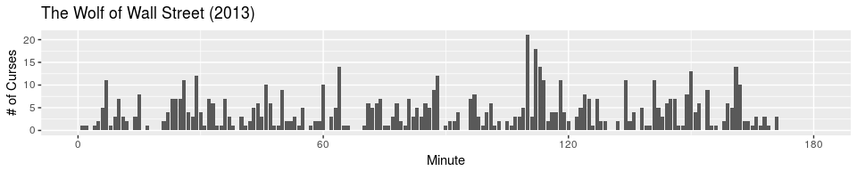

<!-- README.md is generated from README.Rmd. Please edit that file -->
subtitler
=========

[](https://travis-ci.org/benjcunningham/subtitler) [](https://coveralls.io/github/benjcunningham/subtitler?branch=master)

Read and write video subtitle formats.

Install
-------

``` r
devtools::install_github("benjcunningham/subtitler")
```

Quick Demos
-----------

``` r
library(subtitler)
library(tidyverse)
library(tidytext)
library(stringr)
```

### Adjusting Timestamps

    1
    00:00:00,978 --> 00:00:02,539
    Frank, pick up!

    2
    00:00:02,646 --> 00:00:04,414
    Pick up, buddy, pick up, pick
    up, pick up, pick up, pick up!

    3
    00:00:04,548 --> 00:00:06,499
    Hello!
    I got a Code Red, here, pal.

Consider the above SubRip file and suppose we have observed that every subtitle lags by half a second. Using the `add_milliseconds()` function, we can easily adjust the timestamp of every block accordingly. We can even write back to file in the original format using `write_srt()`.

``` r
f <- tempfile()

read_srt("Always_Sunny_S10E04.srt") %>%
  mutate(
    start = add_milliseconds(start, -500),
    end   = add_milliseconds(end,   -500)
  ) %>%
  write_srt(f)
```

### Text Mining

The package may also be useful for getting subtitles into a tidytext workflow. For example, [I previously reproduced](http://benjcunningham.org/2017/03/05/introducing-subtitler-0-1-0.html) part of [this article by Oliver Roeder of FiveThirtyEight](https://fivethirtyeight.com/features/complete-catalog-curses-deaths-quentin-tarantino-films/), cataloging all of the times someone swore in one of Quentin Tarantino's movies. The script below mirrors the analysis on subtitles from *The Wolf of Wall Street*.

``` r
df <- read_srt("The_Wolf_of_Wall_Street.srt")

df %>%
  unnest_tokens(word, text) %>%
  filter(str_detect(word, "[fs](uc|hi)[kt]")) %>%
  mutate(min = floor(as_milliseconds(start) / 6e4)) %>%
  ggplot(aes(min)) +
    geom_bar() +
    labs(x = "Minute", y = "# of Curses", title = "The Wolf of Wall Street (2013)") +
    scale_x_continuous(breaks = seq(0, 180, 60), limits = c(0, 180))
```



License
-------

MIT © Ben Cunningham
